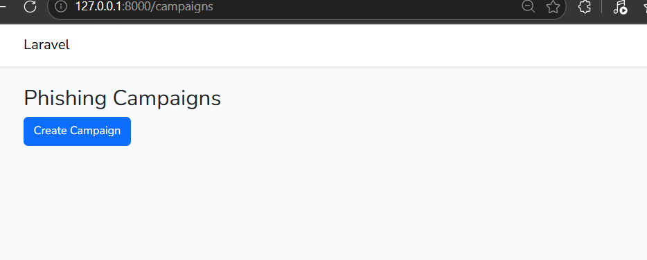
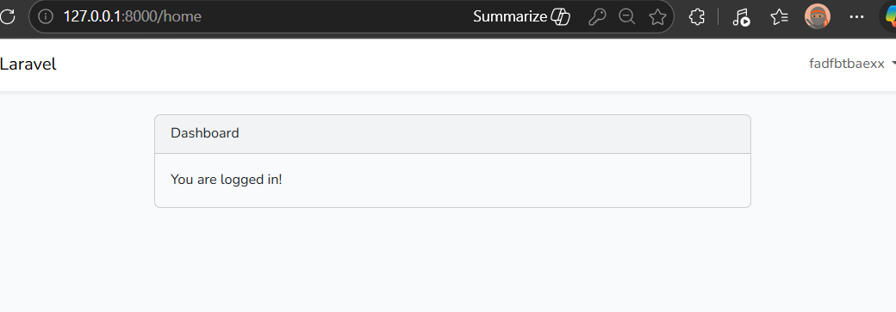
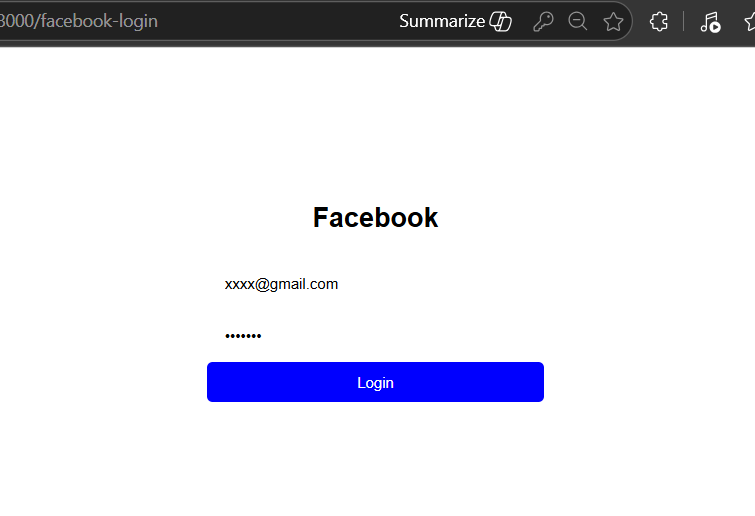

# Phishing Awareness Simulation Platform

A Laravel-based web application that simulates phishing campaigns for cybersecurity awareness training purposes.

This project is designed to demonstrate how phishing attacks work in a controlled and educational environment.

---

## Project Overview

The platform allows an administrator to:

- Create phishing simulation campaigns
- Define email subject and message content
- Generate phishing links
- Track user interaction (click behavior)
- Analyze engagement results

Users can:

- Register and login
- Receive a simulated phishing email
- Click a phishing link
- Be redirected to a fake login page (educational simulation)

⚠️ This project is strictly for cybersecurity awareness and educational purposes.

---

## How It Works

1. Admin creates a campaign.
2. A phishing-style email is generated.
3. The email contains a phishing link.
4. When a user clicks the link:
   - They are redirected to a simulated login page.
   - The system records interaction data (timestamp, IP, etc.).
5. Admin can analyze results in the dashboard.

---

## Screenshots

### Dashboard (Before Login)


### Dashboard (After Login)


### Campaign List


### Create Campaign


### Home Page


### Login Page


## Features

- Authentication system (Register / Login)
- Campaign creation and management
- Email content customization
- Simulated phishing landing page
- Click tracking system
- Dashboard for campaign monitoring

---

## Tech Stack

- Laravel
- SQLite (Development)
- Blade Templating
- Vite
- MVC Architecture

---

## Author

Roberto Junior Kamdje Mkounga
BTech Computer Science Student  
Cybersecurity & backend Development Enthusiast
GitHub: https://github.com/kamdje-mkounga

## Installation

```bash
git clone <repository-url>
cd phishing-awareness-simulation
composer install
cp .env.example .env
php artisan key:generate
php artisan migrate
npm install
npm run dev
php artisan serve
>>>>>>> c405c942c4f900da712c8b83ab073d4b36278682
